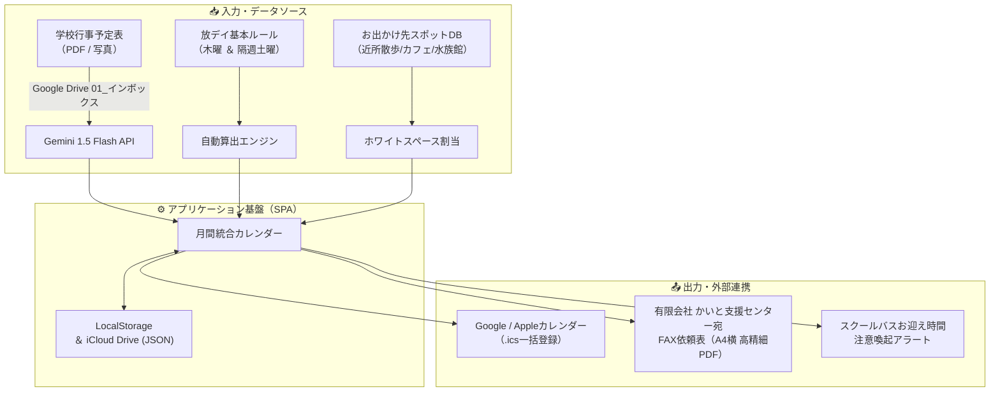

# 華佳ちゃん専用 スケジュール＆お出かけマネージャー 開発記録

> [!NOTE] プロジェクトの目的
> 特別支援学校（高等部）に通う娘・華佳ちゃんの学校行事・下校時間と、放課後等デイサービス（放デイ）・移動支援事業所の利用希望枠を自動照合し、毎月のアナログなFAX提出・スケジュール調整・送迎お迎えの負担をゼロにするWebシステム。

---

## 1. システム全体像 & アーキテクチャ

### 技術スタック
| レイヤー | 採用技術 | 選定理由・特徴 |
| :--- | :--- | :--- |
| **フロントエンド** | HTML5, Modern CSS, Vanilla ES6+ | フレームワーク不要で軽量・超高速。長年の保守性を確保 |
| **ホスティング** | GitHub Pages (`main` / root) | サーバーレス、無料、常時SSL、自動デプロイ |
| **クライアント** | Mac mini M4 Pro / iPad Pro M4 | Safariの「ホーム画面に追加」でフルスクリーンPWA化 |
| **AI解析** | Google Gemini 1.5 Flash API | 学校お便りPDF/画像から行事・下校時間を一発抽出 |
| **帳票生成** | `pdf-lib` (CDN) | 事業所指定の原本フォーマットを1px単位で高精細再現（A4横） |
| **カレンダー連携** | iCalendar (.ics / RFC 5545) | iOS/macOS標準カレンダーやGoogleカレンダーへ一括登録 |
| **データ同期** | LocalStorage + iCloud Drive (JSON) | 外部DBを使わず、Appleエコシステム内で完全プライベート同期 |

---

## 2. 解決した主要課題 & 実装機能

### ① 学校お便り解析 ＆ スクールバスお迎え安心UI
- **課題**: 毎日のスクールバス停へのお迎え時間を勘違いする不安（通常15:00、水曜14:00、行事による早帰り11:30/13:00など日によって異なる）。
- **実装**:
  - Gemini APIがお便りから「下校時間」「行事名」「短縮授業」を自動解析。
  - カレンダーの曜日ヘッダーに基本時間「水 (14:00下校)」「平日 (15:00下校)」を固定表示。
  - 各日付マスに「当日の下校時間（🚌 15:00下校）」をバナー表示。早帰り日は赤色パルス警告。
  - 学年別（高等部・中等部等）の微妙な時刻差も、カレンダーからワンタップで手動修正可能に。

### ② 放デイ カンニングペーパー ＆ 帰宅時間手入力 ＆ 土曜振替
- **課題**:
  - 送迎車の同乗順やルートにより、自宅到着時間が日によって異なる（17:15着、17:45着など）。
  - 基本ルールは「第1・第3土曜」だが、月によって事業所都合で「第2・第4土曜」に変動する。
- **実装**:
  - 放デイ予定をタップすると編集モーダルが開き、帰着時間をワンタップ（または手入力）で調整可能。
  - **今月の土曜日クイック振替チップ（第1土〜第5土）** を自動生成。ワンタップで別週の土曜日に予定・送迎時間を即座に移動・振替。
  - 未登録土曜マスにも `[+ 土曜放デイ追加]` ボタンを設置し、直接登録に対応。

### ③ 平日放課後移動支援（短時間枠）の自動割り出し ＆ 在庫復活
- **課題**: 移動支援は休日だけでなく平日放課後の短時間枠（約2.5時間）の利用が多く、事業所の枠が取れず「見送り」になった行き先を忘れず再利用したい。
- **実装**:
  - 「放デイが入っていない平日」を **平日放課後 短時間枠（15:00〜17:30）** として最優先で空き枠抽出。
  - ステータス（確定 / 希望中 / 見送り）の管理機能。
  - **在庫復活ロジック**: 「見送り」を選択すると、そのお出かけ先スポットは自動的に未達ストックリストに復帰し、次月以降の候補として即座に再利用可能。

### ④ かいと支援センター専用 FAX依頼表 完全再現（A4横PDF）
- **課題**: 指定のFAX用紙を手書きするアナログ作業の撲滅。
- **実装**:
  - 背景画像を敷くのではなく、原本の罫線・枠・フォント・配置をコードで忠実に完全再現。
  - 左上「依 頼 表」二重枠、左下太矢印「◀ ＦＡＸ送信方向」、通し番号、6行7項目テーブルをA4横（Landscape: 1754×1240高精細）でPDF出力・AirPrint印刷。

### ⑤ Google / Appleカレンダー一括登録 (.ics) ＆ iCloud同期
- **カレンダー一括出力**: 放デイ、移動支援、学校行事を標準 `.ics` ファイルで一発出力。
- **iCloud双方向同期**: Mac mini で設定した内容をJSON形式でiCloud Driveに保存し、iPad Pro M4でワンタップ読込。

---

## 3. トラブルシューティング & 技術的知見 (Dev Log)

> [!CHECK] 解決したトラブル一覧

### 1. Gemini API 404エラー
- **事象**: お便り解析ボタン押下時に `POST .../v1beta/models/gemini-1.5-flash:generateContent 404` が発生。
- **原因**: モデル名指定およびエンドポイントパスのバージョニング不整合。
- **対処**: `gemini-1.5-flash` の最新エンドポイントおよびマルチモーダル `inlineData` 送信仕様に正規化して解消。

### 2. pdf-lib CDN MIMEタイプ不一致
- **事象**: コンソールで MIME タイプ ("text/plain") 不一致によりリソースがブロック。
- **原因**: 一部CDNプロバイダのヘッダー応答。
- **対処**: 安定した公式CDN（cdnjs / unpkg）へのフォールバック構成に切り替えて解消。

### 3. GitHub Pages で main ブランチが選択できない（No results found）
- **事象**: GitHub Pagesのブランチ選択で `main` が候補に出てこない。
- **原因**: GitHub上にリポジトリを作成した直後で、Macローカルからの初回コミット＆プッシュが未実行だった（空リポジトリ状態）。
- **対処**: ローカル環境で Git リポジトリを初期化し、`origin main` 宛にプッシュを実行して解消。

### 4. iPad Safari で iCloud JSON 読み込みが反映されない
- **事象**: iPadで「iCloud読込」を押してファイルを選んでも、画面にデータが反映されない。
- **原因**:
  1. `StorageManager.importFromiCloudJson` 内で `FileReader.onload` は定義されていたが、実行メソッド `reader.readAsText(file)` の呼び出しが欠落していた。
  2. `<input type="file">` の `value` がリセットされず、同一ファイルを再度選んだ際に `change` イベントが発火しなかった。
- **対処**: `file.text()` と `readAsText` の両対応ハイブリッド実装に変更し、ボタン押下時と処理完了時に `fileInput.value = ''` でリセットするよう改修。

---

## 4. 今後の拡張アイデア（Memo）
- [ ] 翌月以外の過去アーカイブ閲覧（数ヶ月前の利用履歴の検索）
- [ ] スポットごとの訪問回数カウント・お気に入りランキング表示
- [ ] リマインダー通知（FAX提出期限: 毎月20日直前アラート）

---

## 5. リポジトリ & 配置情報
- **ローカル作業ディレクトリ**: `/Users/nao/.gemini/antigravity/scratch/hanaka-schedule-app`
- **GitHub リポジトリ**: `https://github.com/Nao17830703/hanaka-schedule-app`
- **GitHub Pages 公開URL**: `https://nao17830703.github.io/hanaka-schedule-app/`
- **メインコミット**:
  - `feat: complete Hanaka schedule app with Saturday rescheduling and dismissal tracking`
  - `fix: implement proper file reading and value reset for iCloud JSON import`
